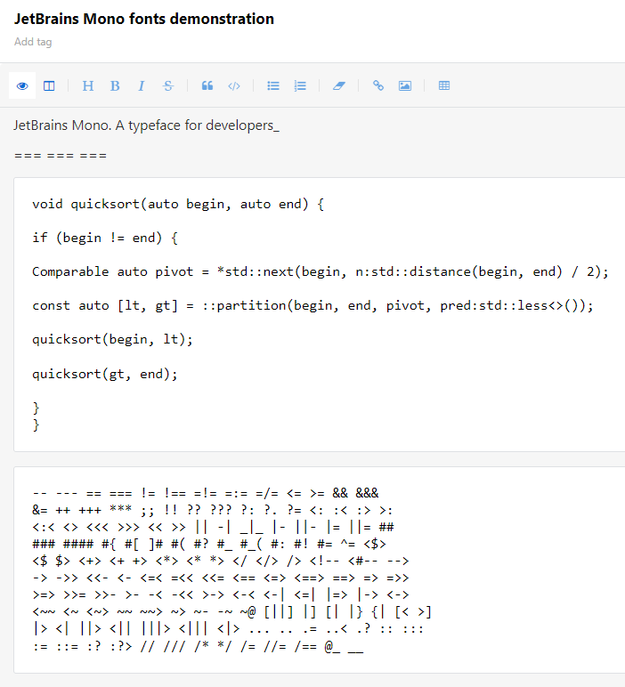
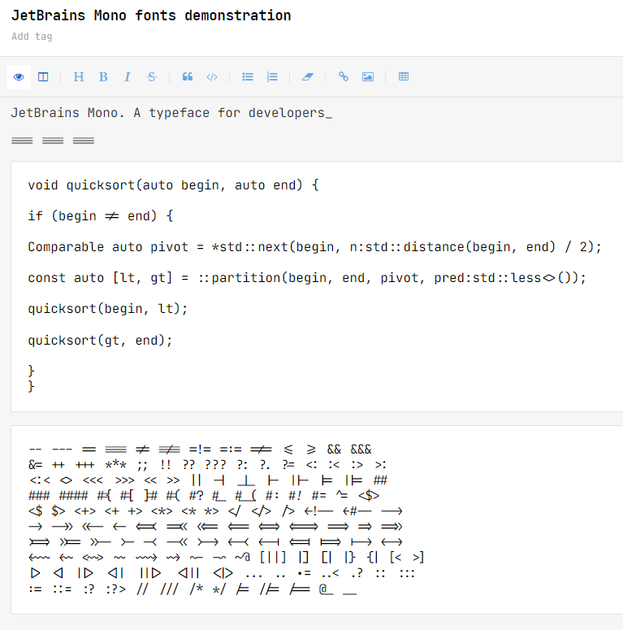

# JetBrains Mono for Standard Notes

JetBrains Mono theme does not change the default theme design. Instead, it adds the JetBrains Mono font for use. Including the font ligature feature.

The developers/ programmers can enjoy editing with Standard Notes with JetBrains Mono font.

## Installation

> Standard Notes Settings Gear -> Open Preferences -> General -> Advanced Settings -> Install Custom Extension -> Enter Extension URL

> Paste the following URL as Extension Link and click Install


```
https://listed.to/p/xxSlhfXCEN
```

## Preview

**Before:**



**After:**


